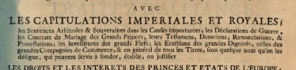

<h1> Literatur und Quellen </h1>

<figure>
  
  <figcaption> <a href="https://www.digitale-sammlungen.de/de/view/bsb10491322?page=,1">
Quelle: DuMont: Corps Universel du Droit des Gens, Bd. V, 2, 1728, S. 476
 </a></figcaption>
</figure>

Nachfolgend finden Sie verschiedene Listen mit den vollständigen Angaben der Quelleneditionen und Forschungsliteratur, die wir im Projekt verwenden. Außerdem finden Sie eine Liste, mit deren Hilfe Sie die Kurzbezeichnungen der in der Vertragsdatenbank angegeben Archive aufschlüsseln können. Außerdem finden Sie hier eine interaktive PDF-Datei mit allen Glossareinträgen.

Alle Listen und Dokumente können als PDF-Dateien heruntergeladen werden. Die Listen werden von uns regelmäßig aktualisiert. Sollten Sie dennoch in der Datenbank oder im Glossar Angaben zu Archiven, Editionen oder Literaturtiteln finden, die Sie mithilfe dieser Listen nicht aufschlüsseln können, bitten wir Sie um eine Rückmeldung, damit wir dies beheben können.

Downloads:

[Vollständige Literaturangaben zum Glossar](/literatur.pdf) 
[Quellen und Literatur zur Vertragsdatenbank](/quellen.pdf) 
[Angaben zu Archiven](/archive.pdf) 
[Glossar als interaktives PDF](/glossar.pdf)
